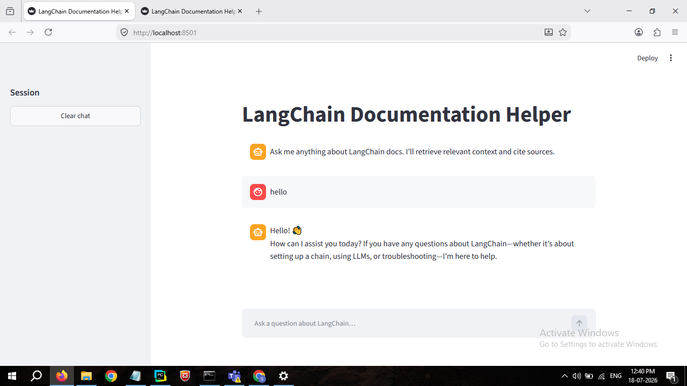
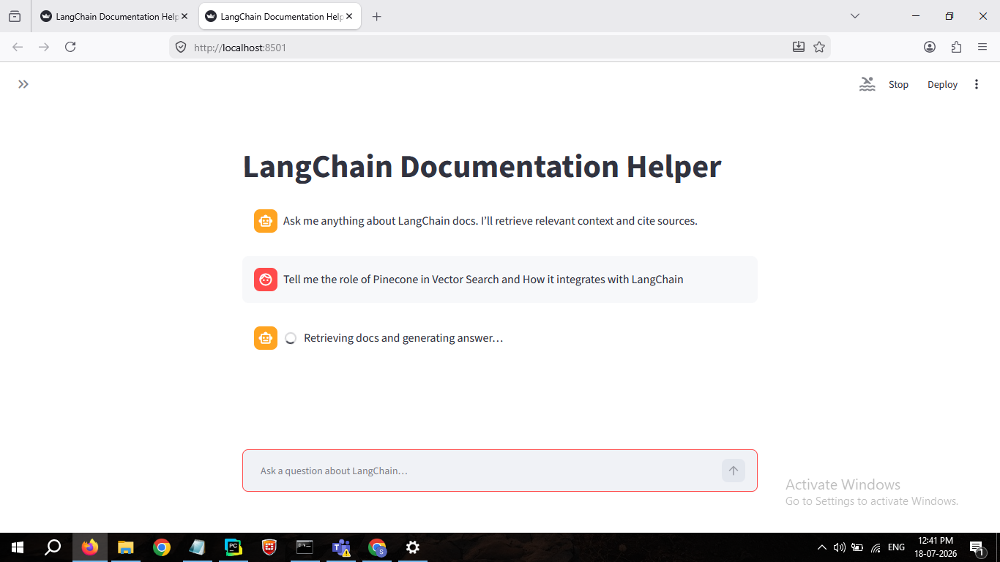
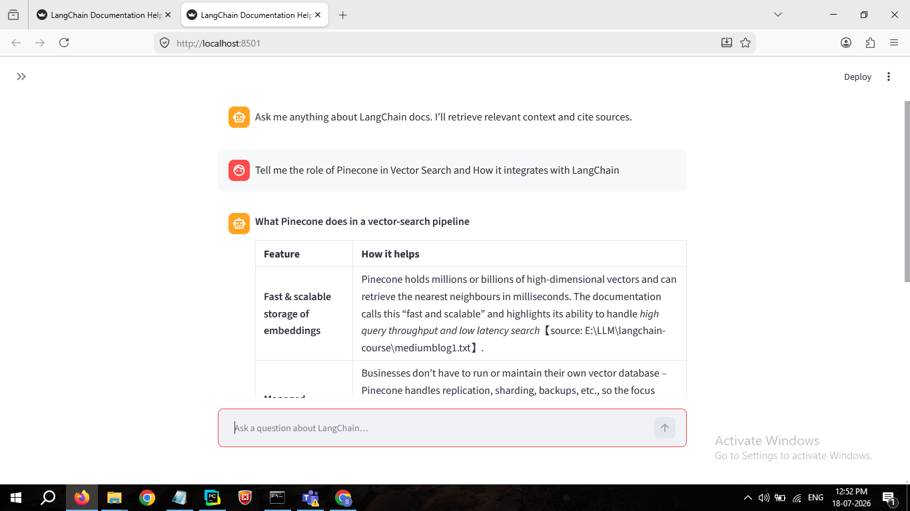
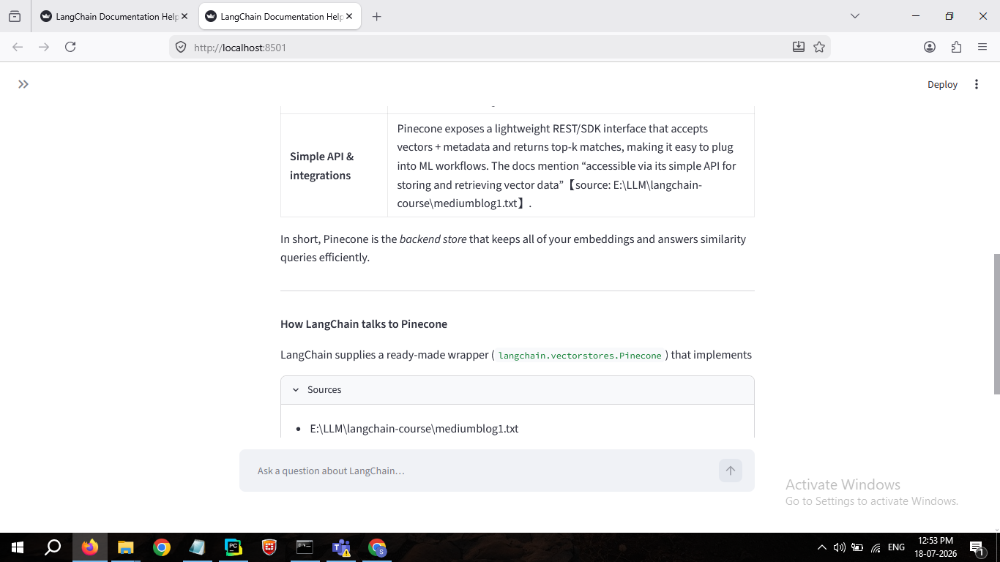

<div align="center">

# 📚 Documentation Helper
### AI-Powered Documentation Assistant using Retrieval-Augmented Generation (RAG)

The Documentation Helper is a Retrieval-Augmented Generation (RAG) application that enables users to ask natural language questions about technical documentation through a conversational interface. Instead of manually searching documentation, the application retrieves the most relevant content, provides contextual responses using a locally hosted large language model, and cites the original documentation sources used to generate each answer.

Built with **Python • LangChain • Pinecone • Ollama • Tavily • Streamlit**


</div>

---
# 🌟 Overview

Documentation Helper is an AI-powered documentation assistant that enables developers to query technical documentation using natural language. It combines automated documentation ingestion, semantic retrieval, and locally hosted large language models to deliver accurate, context-aware answers backed by the original source material.

Built as an end-to-end Retrieval-Augmented Generation (RAG) system, the project demonstrates how modern LLM applications can transform static documentation into an interactive, searchable knowledge base.

---

## 🚀 Key Capabilities

- Automatically ingests documentation directly from public websites.
- Builds a semantic knowledge base by chunking content and generating vector embeddings.
- Retrieves the most relevant documentation using similarity search instead of keyword matching.
- Produces grounded answers using retrieved context while preserving source attribution.
- Runs entirely with local embedding and chat models through Ollama.

---

## ✨ Technical Highlights

- End-to-end RAG architecture with separate ingestion, indexing, retrieval, and generation pipelines.
- Automated documentation crawling and preprocessing using Tavily.
- Semantic vector search powered by Pinecone and local embedding models.
- Agentic retrieval workflow built with the latest LangChain APIs.
- Interactive Streamlit application for conversational documentation search.
- Modular architecture that can be extended to additional documentation sources with minimal configuration.

# 🎯 Why This Project?

Traditional documentation search relies on keyword matching.

This project demonstrates how **Retrieval-Augmented Generation (RAG)** enables AI systems to understand the *meaning* of a query rather than matching exact words.

Example:

**Instead of searching**

> "agent framework memory"

You can simply ask

> "How does LangChain manage memory inside an agent?"

and receive a contextual answer with documentation references.

---

# 🏗️ System Architecture

```text
                        Documentation Website
                                  │
                                  ▼
                        Tavily Documentation Crawl
                                  │
                                  ▼
                     Extract & Clean Documentation
                                  │
                                  ▼
                 Recursive Character Text Splitter
                                  │
                                  ▼
                   Ollama Embedding Model
             (snowflake-arctic-embed2)
                                  │
                                  ▼
                     Pinecone Vector Database
                                  │
                                  ▼
                  Similarity Search (Top-K Chunks)
                                  │
                                  ▼
                  LangChain Agent + Ollama LLM
                                  │
                                  ▼
                    Streamlit Conversational UI
```

---

# ⚙️ Technology Stack

| Layer | Technology |
|--------|------------|
| Language | Python |
| Framework | LangChain |
| Vector Database | Pinecone |
| Embeddings | Ollama |
| Chat Model | Ollama |
| Web Crawling | Tavily |
| Frontend | Streamlit |
| Environment | UV |
| Prompt Orchestration | LangChain Agents |

---

# 📂 Project Structure

```text
documentation-helper/

├── backend/
│   ├── core.py
│   ├── prompts.py
│   └── ...
│
├── frontend/
│   ├── app.py
│   └── ...
│
├── ingestion.py
├── .env.example
├── pyproject.toml
├── uv.lock
└── README.md
```

---

# 🚀 How It Works

## Step 1 — Crawl Documentation

The application crawls an entire documentation website.

```
Documentation Website
            │
            ▼
      Tavily Crawl
```

---

## Step 2 — Split Documents

Large pages are divided into smaller semantic chunks.

```
Large Page

↓

Chunk 1

↓

Chunk 2

↓

Chunk 3
```

---

## Step 3 — Generate Embeddings

Each chunk is converted into a dense vector representation.

```
Text

↓

Embedding Vector
```

---

## Step 4 — Store in Pinecone

Embeddings are indexed for efficient semantic retrieval.

```
Embedding

↓

Pinecone Index
```

---

## Step 5 — User Query

```
What are Deep Agents?
```

↓

Generate Query Embedding

↓

Retrieve Similar Chunks

↓

LLM generates grounded response

↓

Display answer + documentation source

---

# 💬 Example

### User

```
What are Deep Agents?
```

---

### Assistant

```
Deep Agents are autonomous AI systems capable of
reasoning, planning and using tools to accomplish
multi-step objectives.

Source:
https://python.langchain.com/...
```

---

# 🚀 Getting Started

## Clone Repository

```bash
git clone https://github.com/Shubham2900/documentation-helper.git
cd documentation-helper
```

---

## Create Virtual Environment

```bash
uv venv
```

---

## Activate Environment

### Windows

```powershell
.venv\Scripts\activate
```

### Linux / macOS

```bash
source .venv/bin/activate
```

---

## Install Dependencies

```bash
uv sync
```

---

## Configure Environment Variables

Create a `.env`

```text
PINECONE_API_KEY=YOUR_API_KEY
INDEX_NAME=documentation-helper
TAVILY_API_KEY=YOUR_API_KEY
```

---

## Download Ollama Models

```bash
ollama pull snowflake-arctic-embed2
ollama pull gpt-oss:20b
```

---

## Build the Knowledge Base

```bash
uv run python ingestion.py
```

---

## Launch the Application

```bash
uv run streamlit run frontend/app.py
```

---

# 📊 Core Workflow

```text
User Question
      │
      ▼
Generate Embedding
      │
      ▼
Pinecone Similarity Search
      │
      ▼
Retrieve Relevant Chunks
      │
      ▼
LangChain Agent
      │
      ▼
Ollama Chat Model
      │
      ▼
Grounded Response
```

---

# 🎯 Skills Demonstrated

- Retrieval-Augmented Generation (RAG)
- Semantic Search
- Vector Databases
- Prompt Engineering
- AI Agents
- LangChain
- Pinecone
- Ollama
- Documentation Intelligence
- Information Retrieval
- Streamlit Development
- Python Backend Development

---

# 📈 Future Enhancements

- [ ] Hybrid Search (Keyword + Vector)
- [ ] Multi-document support
- [ ] Conversation memory
- [ ] Metadata filtering
- [ ] Streaming responses
- [ ] Source highlighting
- [ ] Docker deployment
- [ ] Authentication
- [ ] Cloud deployment
- [ ] Support multiple LLM providers

---

# 📸 Demo

### Home Screen

> 

---
### Answer Loading Screen

> 

---
### Answer

> 

---
### Sources

> 

---

# 🤝 Acknowledgements

This project was inspired by educational content from **Eden Marco**. The implementation has been adapted and updated to work with the latest LangChain ecosystem, including current APIs for LangChain, Pinecone, Ollama, and UV.

---

# 👨‍💻 Author

**Shubham Bishnoi**

**LinkedIn**
linkedin.com/in/shubham-bishnoi-32b240163

**GitHub**
https://github.com/Shubham2900

---

<div align="center">

### ⭐ If you found this project useful, consider giving it a star!

</div>